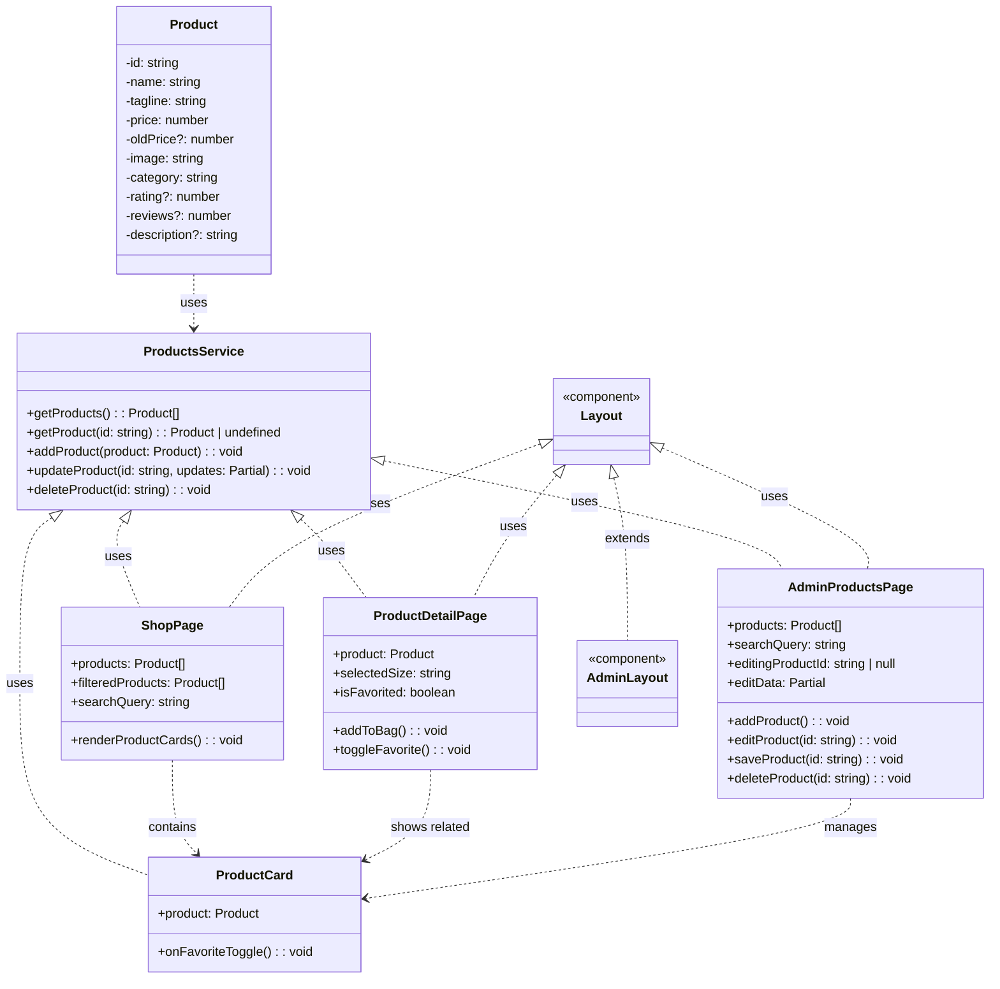

# Product Management Class Diagram

This diagram illustrates the structure for managing multiple products in the e-commerce frontend.

## Component Responsibilities

### Product Data Model
- Represents a single product with all its attributes
- Used throughout the application for displaying and managing products

### Products Service
- Handles all product data operations
- Uses localStorage for persistence in this frontend-only implementation
- Provides CRUD operations for products

### ProductCard Component
- Displays a single product in a card format
- Shows product image, name, tagline, price, and favorite button
- Used in shop page, product detail page (related products), and admin panel

### Shop Page
- Main product listing page
- Displays products in a grid layout
- Includes category filtering and search functionality

### Product Detail Page
- Shows detailed information for a single product
- Includes size selection, description, and add-to-bag functionality
- Displays related products

### Admin Products Page
- Interface for managing products
- Allows adding, editing, and deleting products
- Features inline editing for product attributes
- Includes search functionality to filter products

## Data Flow
1. ProductsService manages product data in localStorage
2. Components retrieve product data through ProductsService methods
3. AdminProductsPage modifies data through ProductsService
4. All other components automatically reflect changes through service calls
5. ProductCard is a reusable component used across multiple views